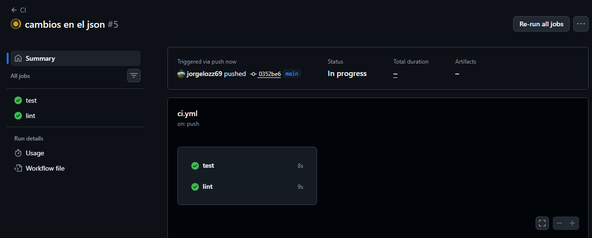
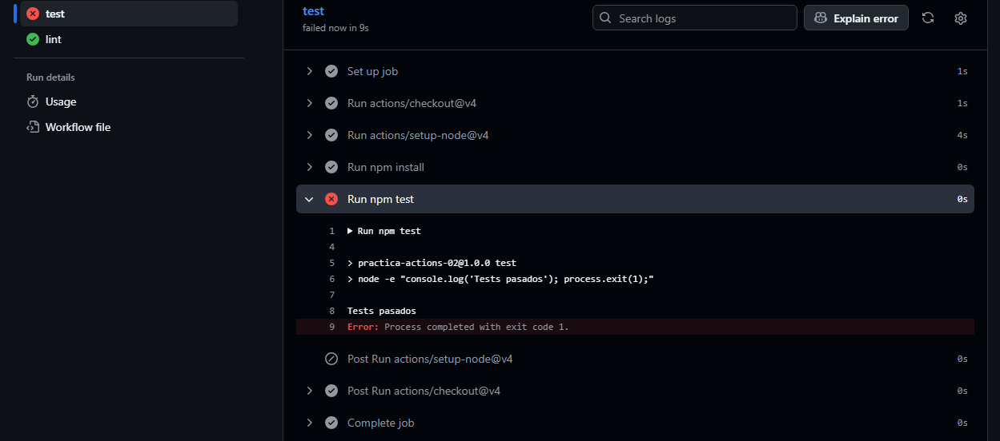
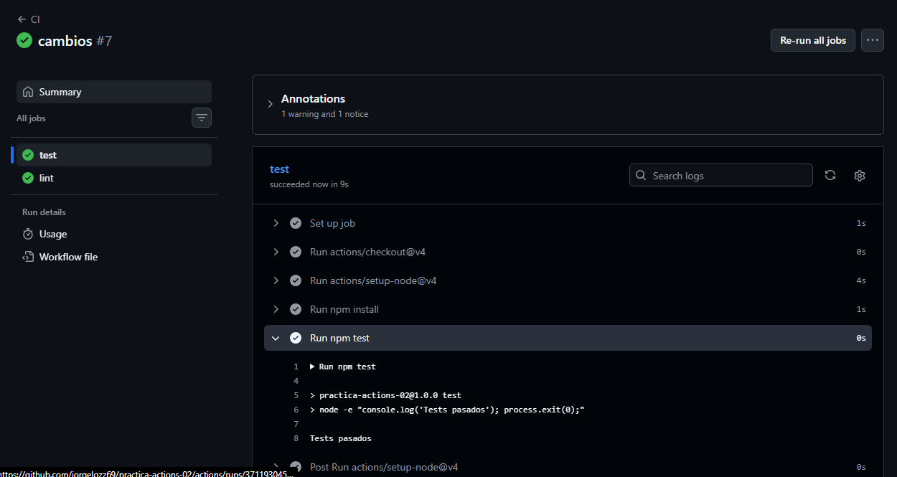

# practica-actions-02
 
Captura del pipeline con test y lint ejecutándose en paralelo, ambos en verde.

 
Captura del pipeline en rojo tras romper el test a propósito, con el log del error abierto.
 

Captura del pipeline de nuevo en verde tras la corrección.

