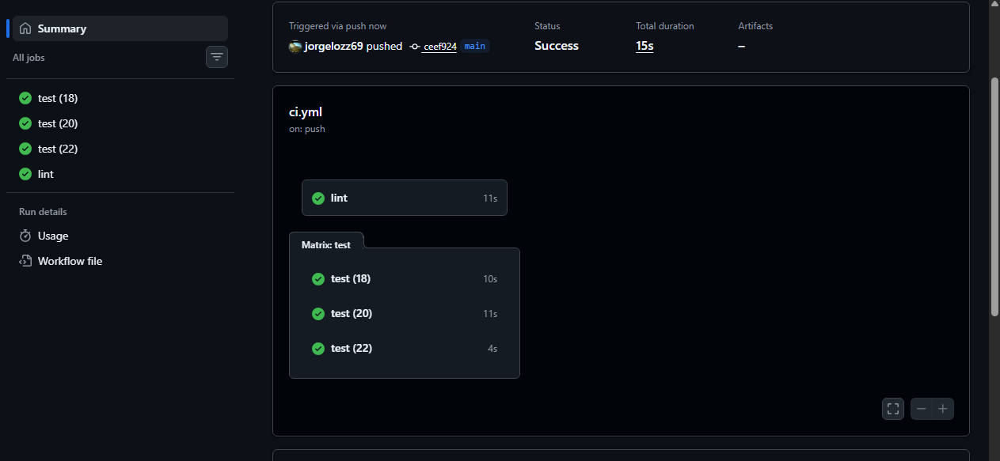
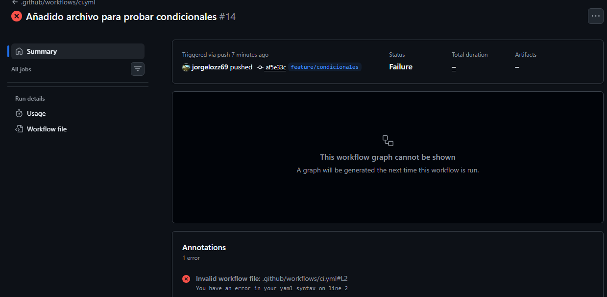
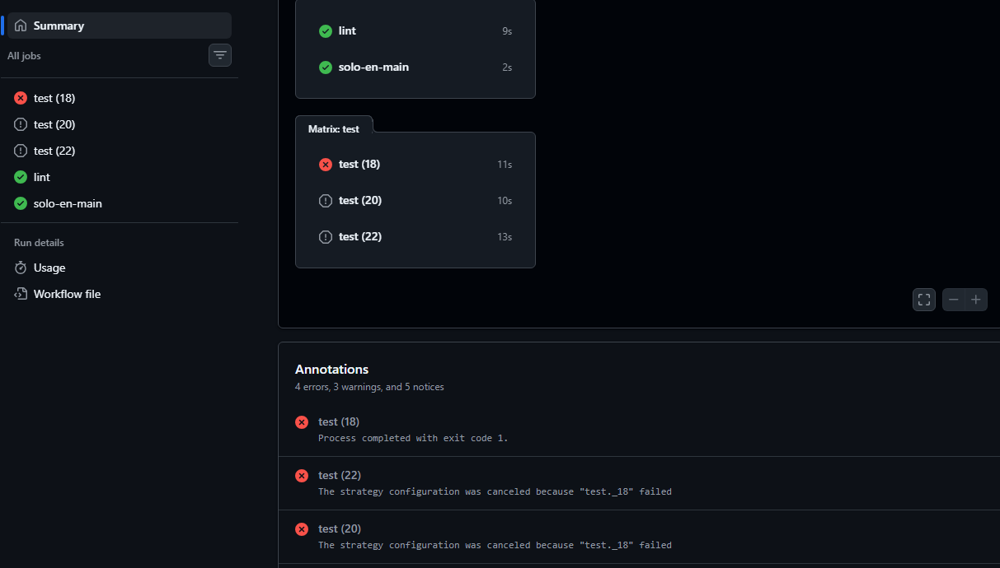

# practica-actions-02
 
Captura del pipeline con test y lint ejecutándose en paralelo, ambos en verde.

 
Captura del pipeline en rojo tras romper el test a propósito, con el log del error abierto.
 

Captura del pipeline de nuevo en verde tras la corrección.

Ejercicio de actions 3

Captura de las tres ejecuciones paralelas del job test por matrix.
 

Captura mostrando que solo-en-main no se ejecuta en la Pull Request pero sí tras el merge.
 

Captura del log con los steps failure() y always() ejecutados tras un fallo forzado.

